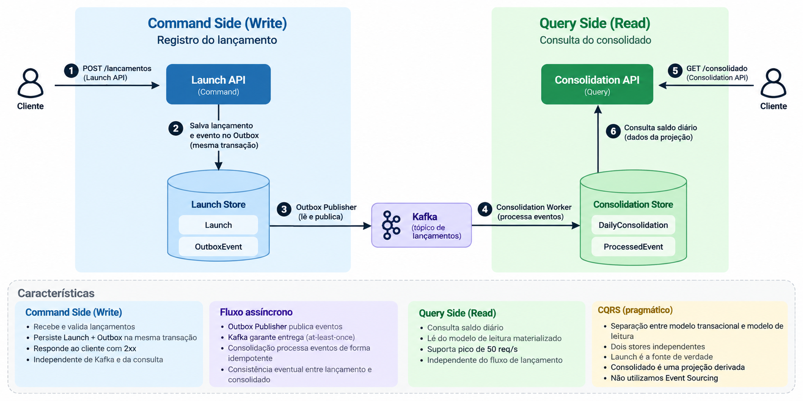

# ADR-005 — CQRS e separação entre modelos de escrita e leitura

**Status:** Accepted  
**Date:** 2026-09-29

## Contexto

A solução possui dois fluxos com responsabilidades e características operacionais diferentes.

O fluxo de lançamento precisa priorizar:

- durabilidade do lançamento financeiro;
- disponibilidade para receber novos lançamentos;
- independência em relação à disponibilidade do serviço de consolidação;
- persistência transacional do lançamento e de sua intenção de publicação.

O fluxo de consulta do consolidado precisa priorizar:

- leitura eficiente do saldo diário;
- independência do modelo transacional dos lançamentos;
- capacidade de atender ao volume de consultas esperado;
- acesso a uma projeção previamente consolidada.

Utilizar o mesmo modelo de dados para escrita e leitura aumentaria o acoplamento entre responsabilidades com necessidades distintas.

Além disso, a comunicação assíncrona adotada pela solução estabelece uma separação natural entre o estado transacional dos lançamentos e a projeção utilizada para consulta.

## Decisão

Será utilizado **CQRS (Command Query Responsibility Segregation)** de forma pragmática, separando as responsabilidades, os modelos de dados e seus respectivos schemas de persistência.

A arquitetura será dividida em:

- **Command Side**, responsável pelo registro dos lançamentos;
- **Query Side**, responsável pela manutenção e consulta do consolidado diário.

O CQRS adotado nesta solução não implica Event Sourcing, utilização de Event Store ou adoção de um framework específico de CQRS.

A separação será implementada inicialmente utilizando uma única instância PostgreSQL com schemas distintos:

```text
PostgreSQL
│
├── launch
│   ├── Launch
│   └── OutboxEvent
│
└── consolidation
    ├── DailyConsolidation
    └── ProcessedEvent
```

Os schemas representam fronteiras lógicas distintas.

Cada serviço acessará apenas os dados pertencentes à sua responsabilidade.

A comunicação entre os dois modelos ocorrerá por eventos através do Kafka, e não por acesso direto às tabelas do outro schema.

O fluxo arquitetural é representado abaixo:



## Command Side

O `Launch Service` representa o lado de escrita da solução.

A `Launch API` recebe e valida novos lançamentos financeiros.

O schema `launch` contém:

```text
launch
├── Launch
└── OutboxEvent
```

`Launch` representa o lançamento financeiro aceito pela aplicação.

`OutboxEvent` registra, na mesma transação, a intenção de publicar o evento correspondente.

O modelo transacional de lançamentos representa a fonte de verdade dos lançamentos financeiros.

A confirmação de um lançamento depende exclusivamente da conclusão da transação local que persiste:

```text
Launch
   +
OutboxEvent
```

e não da disponibilidade imediata do Kafka ou do `Consolidation Service`.

Conceitualmente:

```text
Cliente
   ↓
Launch API
   ↓
Launch + OutboxEvent
   ↓
COMMIT
   ↓
HTTP 2xx
```

Após o commit, o `Outbox Publisher` publica os eventos pendentes no Kafka de forma assíncrona.

## Fluxo assíncrono

Kafka conecta o Command Side ao processamento responsável pela atualização do Query Side.

O fluxo ocorre conceitualmente como:

```text
schema launch
     ↓
Outbox Publisher
     ↓
Kafka
     ↓
Consolidation Worker
     ↓
schema consolidation
```

O `Consolidation Worker` consome os eventos e atualiza a projeção utilizada para consulta.

Essa comunicação é assíncrona.

Portanto, não existe a expectativa de que o consolidado seja atualizado dentro da mesma transação ou da mesma requisição que registrou o lançamento.

A solução assume **consistência eventual** entre o lançamento confirmado e sua representação no consolidado.

Se o processamento da consolidação estiver temporariamente indisponível, novos lançamentos continuam sendo aceitos.

Quando o processamento for restabelecido, os eventos pendentes serão consumidos e a projeção convergirá para o estado correspondente aos lançamentos registrados.

## Query Side

O `Consolidation Service` representa o lado de leitura e manutenção da projeção consolidada.

A `Consolidation API` é uma borda independente da `Launch API`.

Ela não participa do fluxo de criação de lançamentos e não consulta o schema `launch` para calcular o saldo.

O schema `consolidation` contém:

```text
consolidation
├── DailyConsolidation
└── ProcessedEvent
```

`DailyConsolidation` representa a projeção materializada utilizada para responder às consultas de saldo diário.

`ProcessedEvent` participa das garantias de idempotência durante a atualização dessa projeção.

O `Consolidation Worker` é responsável pela escrita no modelo de consolidação.

A `Consolidation API` consulta a projeção materializada.

Conceitualmente:

```text
Kafka
   ↓
Consolidation Worker
   ↓
DailyConsolidation
   ↑
Consolidation API
   ↑
Cliente
```

A consulta ocorre diretamente sobre `DailyConsolidation`:

```text
Cliente
   ↓
Consolidation API
   ↓
DailyConsolidation
   ↓
HTTP 200 + saldo diário
```

Não é necessário consultar todos os lançamentos ou recalcular o saldo durante cada requisição.

O trabalho de consolidação é realizado previamente pelo processamento assíncrono dos eventos.

## Isolamento dos modelos

Embora os dois modelos utilizem inicialmente a mesma instância PostgreSQL, eles permanecem logicamente isolados.

O `Launch Service` possui ownership sobre:

```text
launch.Launch
launch.OutboxEvent
```

O `Consolidation Service` possui ownership sobre:

```text
consolidation.DailyConsolidation
consolidation.ProcessedEvent
```

Um serviço não utilizará as tabelas pertencentes ao outro schema como mecanismo de integração.

Em particular, o `Consolidation Service` não consulta diretamente `launch.Launch` para produzir ou responder o consolidado.

A integração entre os modelos ocorre exclusivamente pelo fluxo de eventos definido pela arquitetura.

Essa regra preserva a fronteira entre Command Side e Query Side mesmo utilizando a mesma infraestrutura física de banco de dados.

## Separação lógica e infraestrutura física

CQRS não exige que Command Side e Query Side utilizem servidores ou tecnologias de banco de dados diferentes.

Para os requisitos atuais, introduzir duas instâncias PostgreSQL independentes adicionaria complexidade operacional sem uma necessidade demonstrada de escala ou disponibilidade que justificasse essa separação.

Por isso, a implementação inicial utilizará:

```text
uma instância PostgreSQL
          │
          ├── schema launch
          │
          └── schema consolidation
```

A separação arquitetural está nos modelos, no ownership dos dados e na ausência de acesso direto entre as fronteiras.

Caso requisitos futuros justifiquem isolamento físico, os schemas poderão evoluir para bancos ou infraestruturas independentes.

Conceitualmente:

```text
Hoje

PostgreSQL
├── launch
└── consolidation


Possível evolução

PostgreSQL / Launch
└── launch

PostgreSQL / Consolidation
└── consolidation
```

Essa evolução não altera a responsabilidade de cada modelo nem o mecanismo de integração entre eles.

Kafka continua sendo a fronteira de comunicação entre Command Side e Query Side.

## Fonte de verdade e projeção derivada

Os dois modelos possuem responsabilidades diferentes.

O schema `launch` contém o estado transacional original dos lançamentos.

O schema `consolidation` contém uma projeção derivada desses lançamentos.

Portanto:

```text
Launch
  =
dado de negócio
fonte de verdade


DailyConsolidation
  =
projeção derivada
otimizada para leitura
```

O consolidado não substitui os lançamentos originais.

A projeção existe para fornecer uma representação adequada às necessidades de consulta.

Sua atualização ocorre a partir dos eventos produzidos pelo Command Side.

A possibilidade operacional de reconstrução completa da projeção dependerá da disponibilidade e da retenção dos eventos necessários para esse processo.

## Independência dos fluxos

A separação entre Command Side e Query Side permite que falhas afetem os fluxos de maneiras diferentes.

### Consolidation API indisponível

A indisponibilidade da API de consulta não impede a criação de novos lançamentos.

```text
Consolidation API
      X

Launch API
    ↓
continua aceitando lançamentos
```

### Consolidation Worker indisponível

Novos lançamentos continuam sendo aceitos.

O processamento da projeção fica temporariamente atrasado e o consumer lag aumenta.

Quando os workers retornarem, o processamento continua.

### Kafka indisponível

Enquanto a persistência transacional estiver disponível, novos lançamentos podem continuar sendo confirmados.

Os eventos permanecem pendentes na Outbox até que a publicação possa ser retomada.

### Projeção temporariamente defasada

Como existe consistência eventual, a `Consolidation API` pode continuar disponível enquanto a projeção ainda não contém os lançamentos mais recentes.

Nesse cenário, a consulta representa o último estado consolidado processado com sucesso.

A arquitetura prefere uma projeção temporariamente defasada à introdução de dependência síncrona entre os dois fluxos.

## Escalabilidade

A separação entre responsabilidades permite que escrita, processamento e leitura sejam dimensionados de acordo com suas próprias características.

Conceitualmente:

```text
Launch API
   ↓
escala conforme volume de comandos


Consolidation Worker
   ↓
escala conforme volume e lag de eventos


Consolidation API
   ↓
escala conforme volume de consultas
```

O requisito de pico de consultas ao consolidado não exige aumento correspondente da capacidade da `Launch API`.

Da mesma forma, um backlog de eventos pode exigir aumento da capacidade dos workers sem necessariamente aumentar a quantidade de instâncias da API de consulta.

A utilização inicial da mesma instância PostgreSQL não elimina essa separação das camadas de aplicação.

Caso o banco de dados se torne futuramente um limite para escalabilidade ou disponibilidade independente, a separação lógica existente permite a evolução das persistências sem redefinir as responsabilidades arquiteturais.

## Escopo do CQRS

A adoção de CQRS será intencionalmente limitada às necessidades desta solução.

Fazem parte da decisão:

- separação entre Command Side e Query Side;
- modelos de dados distintos;
- schemas distintos;
- ownership explícito dos dados;
- projeção materializada para leitura;
- comunicação assíncrona entre os modelos;
- consistência eventual.

Não fazem parte desta decisão:

- Event Sourcing;
- Event Store como fonte de verdade;
- frameworks específicos de CQRS;
- bancos de dados fisicamente separados como requisito inicial;
- replicação síncrona entre os modelos;
- transação distribuída entre Command Side e Query Side;
- consistência forte entre lançamento e consolidado;
- acesso direto às tabelas pertencentes à outra fronteira.

A arquitetura utiliza CQRS para separar responsabilidades com necessidades diferentes, e não como objetivo em si mesmo.

## Consequências

### Positivas

- separação clara entre escrita e leitura;
- modelo transacional permanece independente do fluxo de consulta;
- `Consolidation API` consulta uma projeção otimizada para leitura;
- consultas não precisam recalcular o saldo a partir dos lançamentos;
- ownership dos dados permanece explícito;
- escrita, processamento e leitura podem evoluir independentemente;
- falhas no Query Side não impedem novos lançamentos;
- o modelo de leitura pode evoluir sem alterar o modelo transacional;
- a arquitetura atende naturalmente ao modelo de consistência eventual;
- a infraestrutura inicial permanece simples;
- existe um caminho claro para separação física das persistências caso requisitos futuros a justifiquem.

### Trade-offs

- existem dois modelos de dados;
- existe duplicação intencional de informação entre fonte transacional e projeção;
- o consolidado pode estar temporariamente defasado;
- é necessário operar e observar o fluxo de atualização da projeção;
- falhas no processamento podem aumentar o atraso entre escrita e leitura;
- a reconstrução completa da projeção depende da disponibilidade dos eventos necessários;
- os dois modelos compartilham inicialmente a mesma infraestrutura PostgreSQL;
- uma indisponibilidade da instância PostgreSQL pode afetar simultaneamente Command Side e Query Side.

## Alternativas consideradas

### Modelo único para escrita e leitura

O mesmo modelo de dados poderia ser utilizado para registrar lançamentos e responder às consultas do consolidado.

A alternativa simplificaria o modelo de persistência, mas aumentaria o acoplamento entre os dois fluxos.

Também faria com que necessidades de leitura e escrita evoluíssem sobre o mesmo modelo, apesar de possuírem características diferentes.

A alternativa foi rejeitada em favor da separação explícita entre modelo transacional e modelo de leitura.

### Calcular o consolidado durante a consulta

A `Consolidation API` poderia consultar os lançamentos e calcular o saldo no momento de cada requisição.

A alternativa eliminaria a projeção materializada, mas transferiria o custo de consolidação para o caminho de leitura.

Também aumentaria o acoplamento entre a API de consulta e o modelo transacional.

A alternativa foi rejeitada porque a projeção incremental permite consultas simples e previsíveis.

### Bancos fisicamente separados desde a primeira versão

Command Side e Query Side poderiam utilizar instâncias PostgreSQL independentes desde a implementação inicial.

Essa abordagem forneceria maior isolamento físico e permitiria operação independente das persistências.

Entretanto, os requisitos atuais não demonstram necessidade suficiente para justificar essa complexidade adicional.

A alternativa não foi adotada na primeira versão.

A separação lógica por schemas preserva as fronteiras necessárias e permite evolução para bancos independentes caso requisitos futuros de escala, disponibilidade ou operação justifiquem essa mudança.

### Acesso direto entre schemas

O `Consolidation Service` poderia acessar diretamente as tabelas do schema `launch`.

Essa alternativa reduziria a necessidade de integração assíncrona para determinados cenários, mas violaria o ownership dos dados e aumentaria o acoplamento entre os modelos.

A alternativa foi rejeitada.

A comunicação entre Command Side e Query Side ocorrerá através dos eventos definidos pela arquitetura.

## Decisões relacionadas

- ADR-001 — Comunicação assíncrona orientada a eventos
- ADR-002 — Apache Kafka como mecanismo de mensageria
- ADR-003 — Transactional Outbox para publicação de eventos
- ADR-004 — Processamento idempotente e atualização concorrente do consolidado
- `docs/architecture/reliability-and-processing-semantics.md` — comportamento diante de falhas, redelivery, idempotência e concorrência
