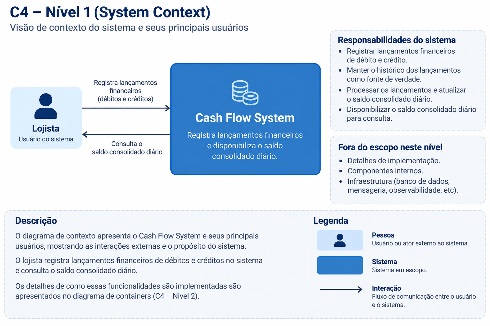
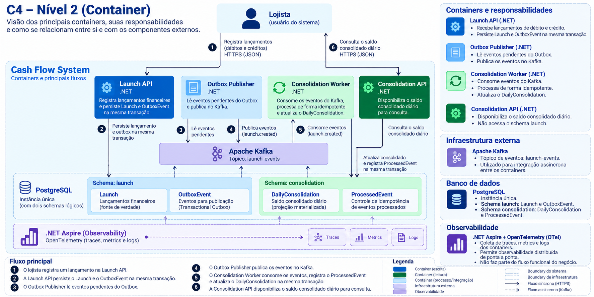

# C4 Model

Este documento apresenta a arquitetura da solução utilizando o modelo C4.

Para o escopo atual são utilizados dois níveis:

- **C4 — Nível 1: System Context**, apresentando o sistema, seu usuário e suas interações externas;
- **C4 — Nível 2: Container**, apresentando os principais componentes executáveis, persistência, mensageria e observabilidade.

Diagramas de componentes internos (C4 — Nível 3) não são utilizados neste momento, pois as responsabilidades e decisões internas relevantes já estão detalhadas nos ADRs, no modelo de dados e no documento de garantias de processamento.

---

# C4 — Nível 1: System Context



## Contexto

O `Cash Flow System` permite que um lojista registre lançamentos financeiros de débito e crédito e consulte o saldo consolidado diário.

Neste nível, o sistema é tratado como uma única unidade.

Detalhes como APIs, banco de dados, Kafka, workers e mecanismos de observabilidade pertencem aos níveis internos da arquitetura e não fazem parte do contexto externo.

## Ator

### Lojista

Usuário responsável por:

- registrar lançamentos financeiros de débito e crédito;
- consultar o saldo consolidado diário.

## Sistema

### Cash Flow System

Responsável por:

- receber e armazenar lançamentos financeiros;
- preservar o histórico transacional como fonte de verdade;
- processar os lançamentos;
- manter uma projeção consolidada diária;
- disponibilizar o saldo consolidado para consulta.

---

# C4 — Nível 2: Container



O nível de containers apresenta as principais unidades executáveis da solução e suas relações.

A arquitetura separa os fluxos de escrita, processamento assíncrono e leitura.

## Launch API

Aplicação `.NET` responsável por receber os lançamentos financeiros.

Suas principais responsabilidades são:

- receber lançamentos de débito e crédito;
- validar a requisição;
- persistir `Launch`;
- persistir `OutboxEvent` na mesma transação.

A confirmação da requisição ocorre após a conclusão da transação local.

A disponibilidade do Kafka ou do fluxo de consolidação não participa dessa transação.

## Outbox Publisher

Processo `.NET` responsável por publicar os eventos persistidos na Transactional Outbox.

O processo:

```text
lê OutboxEvent pendente
        ↓
publica no Kafka
        ↓
registra publicação concluída
```

A publicação é independente da transação original que confirmou o lançamento.

Falhas temporárias no Kafka não impedem novos lançamentos de serem persistidos enquanto o banco transacional estiver disponível.

## Apache Kafka

Responsável pela comunicação assíncrona entre o fluxo transacional e o processamento da consolidação.

O tópico utilizado transporta os eventos produzidos a partir dos lançamentos financeiros.

Conceitualmente:

```text
Outbox Publisher
        ↓
      Kafka
        ↓
Consolidation Worker
```

A arquitetura assume processamento **at-least-once**, permitindo redelivery.

A proteção contra efeito financeiro duplicado é responsabilidade do consumidor através de processamento idempotente.

## Consolidation Worker

Processo `.NET` responsável por consumir os eventos do Kafka e atualizar a projeção diária.

Para cada evento:

```text
BEGIN TRANSACTION

INSERT ProcessedEvent

UPSERT DailyConsolidation

COMMIT
```

O registro em `ProcessedEvent` ocorre antes da alteração do consolidado dentro da mesma transação.

A restrição de unicidade de `ProcessedEvent.event_id` impede que o mesmo evento produza efeito financeiro mais de uma vez.

Eventos diferentes podem ser processados concorrentemente através de atualização atômica da projeção.

## Consolidation API

Aplicação `.NET` responsável exclusivamente pela consulta do saldo consolidado diário.

A API consulta diretamente a projeção:

```text
DailyConsolidation
```

Ela não consulta os lançamentos originais para recalcular o saldo e não acessa o schema `launch`.

A indisponibilidade da `Consolidation API` não interfere no recebimento de novos lançamentos.

## PostgreSQL

A implementação inicial utiliza uma única instância PostgreSQL com dois schemas logicamente separados.

```text
PostgreSQL
│
├── launch
│   ├── Launch
│   └── OutboxEvent
│
└── consolidation
    ├── DailyConsolidation
    └── ProcessedEvent
```

O schema `launch` contém a fonte de verdade transacional.

O schema `consolidation` contém a projeção materializada e o controle de idempotência.

Os serviços não utilizam acesso direto ao outro schema como mecanismo de integração.

A comunicação entre as duas fronteiras ocorre através dos eventos publicados no Kafka.

Essa separação lógica permite que as persistências evoluam para bancos fisicamente independentes caso requisitos futuros justifiquem essa mudança.

## Observabilidade

A solução utiliza `.NET Aspire` e `OpenTelemetry` para fornecer observabilidade distribuída.

Os principais sinais observados são:

```text
traces
metrics
logs
```

A instrumentação permite acompanhar o fluxo completo:

```text
Launch API
    ↓
Outbox Publisher
    ↓
Kafka
    ↓
Consolidation Worker
    ↓
Consolidation API
```

Além da telemetria da aplicação, métricas operacionais relevantes incluem:

- quantidade de eventos pendentes na Outbox;
- falhas de publicação;
- consumer lag;
- tempo de processamento;
- erros de processamento;
- latência das APIs;
- taxa de requisições;
- health e readiness dos containers.

O `.NET Aspire Dashboard` será utilizado no ambiente local para visualização de traces, métricas e logs.

OpenTelemetry mantém a instrumentação desacoplada do backend de observabilidade, permitindo evolução futura da plataforma sem alterar a instrumentação da aplicação.

---

# Fluxo principal

O fluxo completo de um lançamento ocorre da seguinte forma:

```text
Lojista
   ↓
Launch API
   ↓
Launch + OutboxEvent
   ↓
COMMIT
   ↓
Outbox Publisher
   ↓
Kafka
   ↓
Consolidation Worker
   ↓
ProcessedEvent + DailyConsolidation
   ↓
COMMIT
```

A consulta ocorre por um caminho independente:

```text
Lojista
   ↓
Consolidation API
   ↓
DailyConsolidation
```

Essa separação permite que o fluxo de lançamento continue disponível mesmo quando componentes responsáveis pela consolidação estiverem temporariamente indisponíveis.

---

# Fronteiras arquiteturais

A arquitetura possui três responsabilidades principais:

```text
COMMAND
Launch API
Launch
OutboxEvent

        ↓ eventos

PROCESSING
Outbox Publisher
Kafka
Consolidation Worker

        ↓ projeção

QUERY
DailyConsolidation
Consolidation API
```

Essas fronteiras permitem evolução e escalabilidade independentes dos diferentes fluxos da aplicação.

---

# Documentos relacionados

- `docs/architecture/blueprint.md` — visão geral e premissas arquiteturais;
- `docs/architecture/data-model.md` — modelo lógico de dados;
- `docs/architecture/reliability-and-processing-semantics.md` — comportamento diante de falhas, redelivery, idempotência e concorrência;
- ADR-001 — comunicação assíncrona orientada a eventos;
- ADR-002 — Apache Kafka e contratos de eventos;
- ADR-003 — Transactional Outbox;
- ADR-004 — processamento idempotente e concorrência;
- ADR-005 — CQRS e separação entre escrita e leitura.
