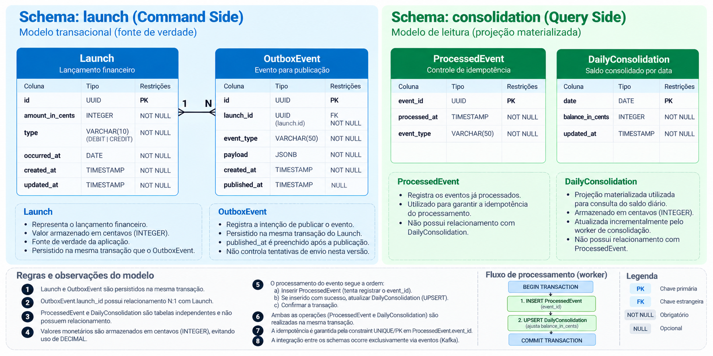

# Modelo de Dados

Este documento apresenta o modelo lógico de dados utilizado pela solução.

A persistência é dividida em dois schemas com responsabilidades distintas:

- `launch` — modelo transacional e fonte de verdade dos lançamentos financeiros;
- `consolidation` — modelo de leitura contendo a projeção materializada do consolidado diário.

A separação segue a abordagem de CQRS definida no ADR-005.

## Visão geral



## Schema `launch`

O schema `launch` contém os dados transacionais da aplicação.

### Launch

Representa um lançamento financeiro de débito ou crédito.

Os valores monetários são armazenados em centavos utilizando `INTEGER`.

Exemplos:

```text
R$ 100,00  →  10000
R$ 25,50   →   2550
R$  0,01   →      1
```

Essa representação mantém as operações monetárias no domínio utilizando valores inteiros e evita representação fracionária durante os cálculos.

`Launch` representa a fonte de verdade dos lançamentos financeiros.

### OutboxEvent

Representa a intenção durável de publicação de um evento associado a um lançamento.

`Launch` e seu respectivo `OutboxEvent` são persistidos na mesma transação local:

```text
BEGIN

INSERT Launch
INSERT OutboxEvent

COMMIT
```

Dessa forma, um lançamento confirmado sempre possui uma intenção de publicação persistida.

A publicação efetiva ocorre posteriormente pelo `Outbox Publisher`.

O preenchimento de `published_at` indica que a publicação foi concluída, mas não constitui garantia de publicação exatamente uma vez.

## Schema `consolidation`

O schema `consolidation` contém o modelo utilizado para processamento e consulta do consolidado diário.

### ProcessedEvent

Registra os eventos que já produziram efeito financeiro na projeção.

`event_id` é a chave primária e funciona como mecanismo de idempotência.

Durante o processamento, o worker tenta registrar o evento antes de alterar o consolidado:

```text
BEGIN

INSERT ProcessedEvent(event_id)

UPSERT DailyConsolidation

COMMIT
```

Caso outro processamento do mesmo `event_id` já tenha sido confirmado, a restrição de unicidade impede que o evento produza novamente efeito financeiro.

### DailyConsolidation

Representa a projeção materializada do saldo diário.

O saldo também é armazenado em centavos utilizando `INTEGER`.

A projeção é atualizada incrementalmente pelo `Consolidation Worker`, evitando recalcular o saldo a partir de todos os lançamentos durante uma consulta.

Para o escopo atual, existe uma única consolidação por data.

A chave `date` garante essa unicidade e permite que a atualização seja realizada atomicamente através de uma operação de criação ou incremento (`UPSERT`).

## Atomicidade do processamento

`ProcessedEvent` e `DailyConsolidation` são tabelas independentes e não possuem relacionamento relacional entre si.

Entretanto, o registro do evento processado e a alteração da projeção são realizados na mesma transação local.

Isso garante que não exista um estado confirmado no qual:

```text
evento registrado
+
saldo não atualizado
```

ou:

```text
saldo atualizado
+
evento não registrado
```

As duas operações são confirmadas ou revertidas conjuntamente.

## Fronteiras de dados

Os schemas possuem ownership independente:

```text
Launch Service
    │
    └── schema launch
        ├── Launch
        └── OutboxEvent


Consolidation Service
    │
    └── schema consolidation
        ├── ProcessedEvent
        └── DailyConsolidation
```

Um serviço não utiliza diretamente as tabelas pertencentes ao outro schema como mecanismo de integração.

A comunicação entre as duas fronteiras ocorre exclusivamente através dos eventos publicados no Kafka.

A implementação inicial utiliza uma única instância PostgreSQL com os dois schemas logicamente separados.

Caso requisitos futuros justifiquem maior isolamento operacional, os schemas podem evoluir para bancos de dados fisicamente independentes sem alterar suas responsabilidades.

## Garantias relevantes

- lançamentos confirmados permanecem registrados na fonte transacional;
- `Launch` e `OutboxEvent` são persistidos atomicamente;
- valores monetários são representados em centavos utilizando `INTEGER`;
- `ProcessedEvent.event_id` impede efeito financeiro duplicado para o mesmo evento;
- o registro de `ProcessedEvent` ocorre antes da alteração do consolidado dentro da mesma transação;
- `ProcessedEvent` e `DailyConsolidation` não possuem relacionamento relacional;
- a atualização do consolidado é incremental e atômica;
- existe apenas uma projeção `DailyConsolidation` por data;
- Command Side e Query Side não compartilham tabelas como mecanismo de integração.

## Documentos relacionados

- ADR-003 — Transactional Outbox para publicação de eventos
- ADR-004 — Processamento idempotente e atualização concorrente do consolidado
- ADR-005 — CQRS e separação entre modelos de escrita e leitura
- `docs/architecture/reliability-and-processing-semantics.md` — garantias de processamento, falhas, redelivery, idempotência e concorrência
