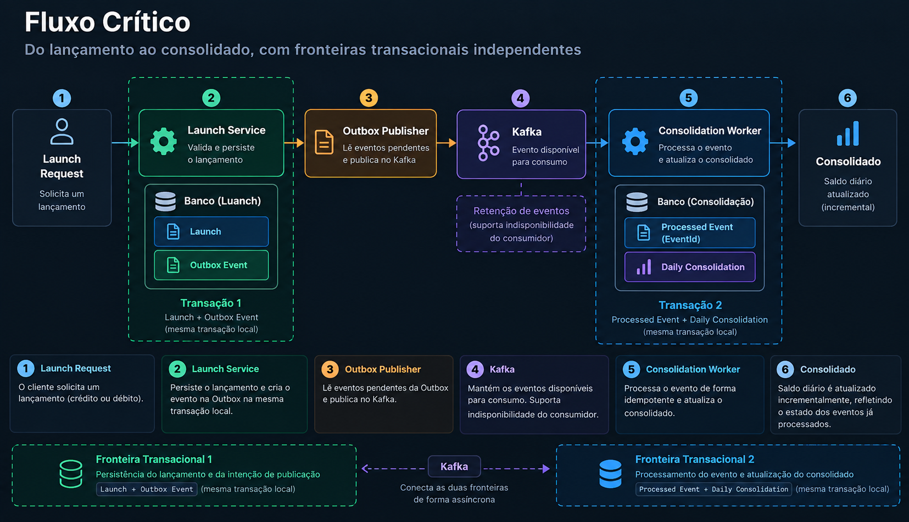
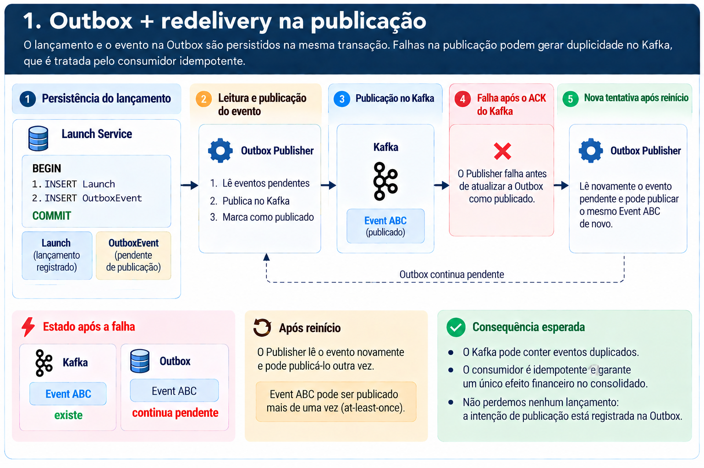
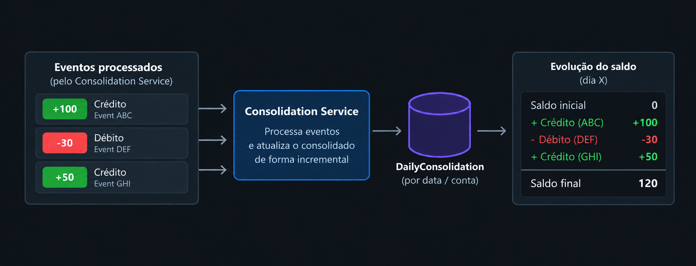
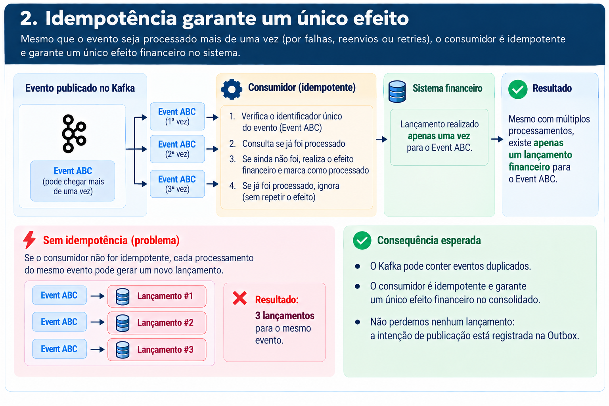
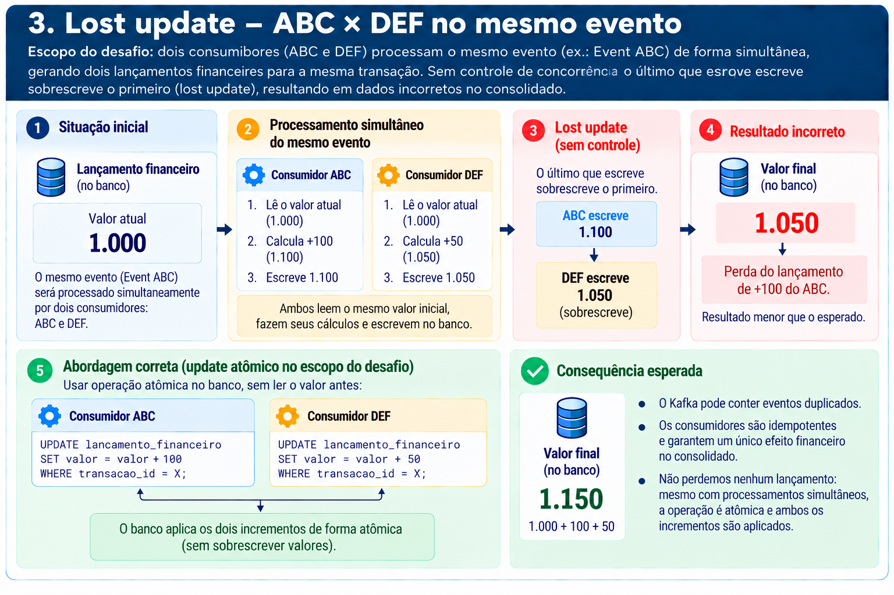
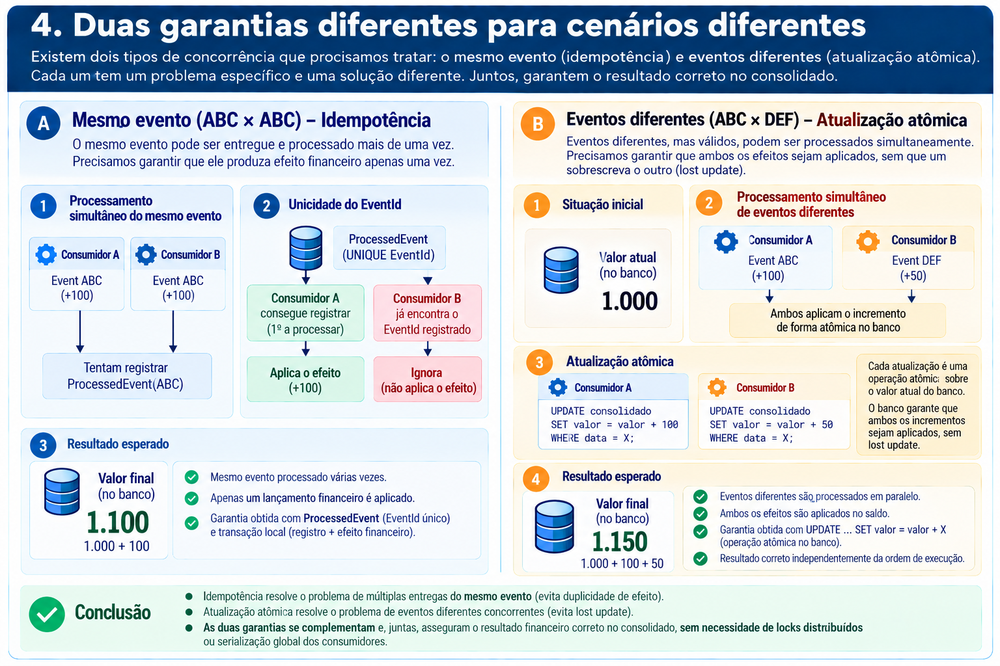

# Reliability and Processing Semantics

Este documento detalha o comportamento do fluxo crítico da solução diante de falhas, redelivery e processamento concorrente.

A premissa é simples: um lançamento confirmado não pode ser perdido e um mesmo evento não pode produzir efeito financeiro mais de uma vez no consolidado.

Não será assumida uma garantia distribuída de `exactly-once` entre Kafka e as persistências envolvidas no fluxo.

---

## 1. Fluxo crítico

O processamento de um lançamento percorre o seguinte fluxo:



Existem duas fronteiras transacionais independentes:

1. persistência do lançamento e da intenção de publicação;
2. processamento do evento e atualização do consolidado.

Kafka conecta essas duas etapas de forma assíncrona.

Não existe uma única transação envolvendo `Launch Service`, Kafka e `Consolidation Service`.

Cada serviço mantém suas próprias transações locais. A consistência entre as etapas é obtida por meio da Outbox, retenção dos eventos no Kafka, redelivery e processamento idempotente.

---

## 2. Persistência do lançamento

O `Launch Service` confirma o lançamento somente depois que sua gravação é concluída.

O lançamento e o evento correspondente na Outbox são gravados na mesma transação:

```text
BEGIN

    Launch
    OutboxEvent

COMMIT
```

As duas gravações formam uma única unidade: ou ambas são confirmadas ou nenhuma delas é.

Dessa forma, não podemos confirmar um lançamento e deixar de registrar a intenção de publicar seu evento.

Se ocorrer uma falha antes do `COMMIT`, as duas alterações são revertidas.

---

## 3. Transactional Outbox

A Outbox registra os eventos que precisam ser publicados no Kafka.

O lançamento e seu `OutboxEvent` são criados na mesma transação. Depois disso, um processo independente, o `Outbox Publisher`, busca os eventos pendentes e tenta publicá-los.

Se Kafka estiver indisponível antes da publicação, o registro de novos lançamentos continua funcionando. O evento permanece pendente na Outbox e poderá ser publicado quando o broker voltar.

Existe, entretanto, uma janela importante de falha.



Kafka pode receber e confirmar um evento e, logo depois, o Publisher falhar antes de atualizar a Outbox.

Nesse momento:

```text
Kafka
Event ABC = publicado

Outbox
Event ABC = ainda pendente
```

Quando o Publisher reiniciar, ele encontrará novamente `Event ABC` entre os eventos pendentes e poderá publicá-lo outra vez.

Portanto, a Transactional Outbox resolve o problema de perder a **intenção de publicação**, mas não tenta garantir que uma mensagem seja publicada apenas uma vez.

Duplicidade é uma condição esperada da arquitetura.

Por esse motivo, a solução trabalha com entrega `at-least-once` e exige processamento idempotente no consumidor.

---

## 4. Kafka e indisponibilidade do consumidor

Depois da publicação, Kafka mantém o evento disponível conforme sua política de retenção.

Se o `Consolidation Service` estiver indisponível, o `Launch Service` continua recebendo e registrando novos lançamentos.

Enquanto os consumidores não processam novos eventos, seus offsets não avançam e o consumer lag aumenta.

Quando o serviço retorna, o processamento continua a partir dos eventos ainda não confirmados pelo consumer group.

A indisponibilidade temporária do consumidor não é, por si só, motivo para enviar eventos para uma Dead Letter Queue.

Uma DLQ será considerada para eventos que não possam ser processados corretamente após a política de tentativas definida, e não simplesmente porque o consumidor ficou temporariamente indisponível.

---

## 5. Consolidação incremental

O saldo diário é mantido como uma projeção atualizada incrementalmente.

Cada lançamento processado produz uma alteração no consolidado correspondente ao seu dia.



Por exemplo, uma sequência de:

```text
+100
-30
+50
```

produz progressivamente:

```text
100
70
120
```

Não é necessário aguardar o encerramento do dia para produzir o consolidado e também não é necessário recalcular todos os lançamentos a cada consulta.

O `Consolidation Service` mantém o estado resultante dos eventos já processados e a API consulta essa projeção.

Como a comunicação é assíncrona, pode existir um intervalo entre o registro de um lançamento e sua representação no consolidado.

Depois que os eventos pendentes forem processados, o consolidado converge para o estado correspondente aos lançamentos registrados.

---

## 6. Redelivery após processamento

Duplicidade também pode surgir depois que o consumidor processou corretamente um evento.

Considere o seguinte cenário:

1. Worker recebe `Event ABC`;
2. Worker aplica seu efeito financeiro;
3. a transação local é confirmada;
4. Worker falha antes de confirmar o offset no Kafka;
5. Kafka entrega `Event ABC` novamente.

O processamento anterior foi válido, mas Kafka ainda não possui a confirmação correspondente do consumer group.

Por isso, redelivery não é tratado como uma situação excepcional.

A arquitetura assume que um mesmo evento pode chegar ao consumidor mais de uma vez.

A garantia necessária não é impedir uma nova entrega, mas impedir que essa nova entrega produza novamente o efeito financeiro.

---

## 7. Idempotência do consumidor

Cada evento possui um `EventId` único.

O `Consolidation Service` mantém um `ProcessedEvent` para registrar quais eventos já produziram efeito no consolidado.

`ProcessedEvent.EventId` possui uma restrição de unicidade.

O registro do processamento ocorre antes da alteração do consolidado, e ambas as operações pertencem à mesma transação local:

```text
BEGIN

    tentar registrar ProcessedEvent(EventId)

    se o EventId foi registrado:
        aplicar o efeito em DailyConsolidation

COMMIT
```

Não utilizamos apenas uma verificação prévia como:

```text
"Esse EventId já foi processado?"
```

seguida posteriormente pela gravação.

Dois workers poderiam realizar essa consulta simultaneamente, ambos receberem a resposta "não" e continuarem o processamento.

A restrição `UNIQUE(EventId)` permite que a própria persistência arbitre essa concorrência.

---

## 8. Mesmo evento processado por dois workers — ABC × ABC

O primeiro cenário de concorrência ocorre quando dois workers tentam processar o **mesmo evento**.



Considere:

```text
Worker A → Event ABC
Worker B → Event ABC
```

Os dois podem iniciar o processamento praticamente ao mesmo tempo.

Ambos tentam registrar:

```text
ProcessedEvent(EventId = ABC)
```

mas a restrição:

```text
UNIQUE(EventId)
```

permite que somente uma tentativa adquira o direito de produzir o efeito financeiro.

Conceitualmente:

```text
Worker A
ABC registrado
      ↓
aplica efeito
      ↓
COMMIT


Worker B
ABC já registrado
      ↓
não aplica efeito
```

Não importa quantas vezes `Event ABC` seja entregue.

O resultado esperado continua sendo:

```text
múltiplas entregas
        ↓
um EventId
        ↓
um efeito financeiro
```

### Por que `ProcessedEvent` permanece junto da consolidação

Foi considerada a utilização de um mecanismo externo, como Redis, para controlar os eventos processados.

Isso criaria duas persistências independentes para representar um mesmo fato.

Se Redis fosse atualizado primeiro:

```text
Redis registra ABC
        ↓
CRASH
        ↓
DailyConsolidation não é atualizado
```

uma nova entrega poderia considerar o evento processado mesmo sem seu efeito financeiro ter sido aplicado.

Se a ordem fosse invertida:

```text
DailyConsolidation é atualizado
        ↓
CRASH
        ↓
Redis não registra ABC
```

uma nova entrega poderia aplicar o mesmo efeito novamente.

Manter `ProcessedEvent` na mesma fronteira transacional do `DailyConsolidation` permite que:

```text
registrar processamento
          +
aplicar efeito financeiro
```

sejam confirmados juntos.

Redis ou um lock distribuído adicionariam outra fronteira de consistência sem resolver melhor a garantia necessária para este fluxo.

Por isso, não fazem parte da estratégia de idempotência adotada.

---

## 9. Atomicidade no Consolidation Service

`ProcessedEvent` e a alteração correspondente em `DailyConsolidation` são confirmados na mesma transação.

Não podemos confirmar:

```text
ProcessedEvent = registrado
DailyConsolidation = não atualizado
```

nem:

```text
ProcessedEvent = não registrado
DailyConsolidation = atualizado
```

Se ocorrer uma falha antes do `COMMIT`, nenhuma das duas alterações é confirmada.

Se a transação for confirmada e o Worker falhar antes do avanço do offset Kafka, o evento poderá ser entregue novamente.

Nesse caso, `EventId` já estará registrado e o efeito financeiro não será aplicado novamente.

A atomicidade existe **por evento**.

Não existe uma transação envolvendo todo o backlog de eventos.

---

## 10. Eventos diferentes concorrendo sobre o mesmo consolidado — ABC × DEF

A idempotência resolve o problema:

```text
ABC × ABC
```

mas existe outro cenário completamente diferente:

```text
ABC × DEF
```

Aqui os eventos são diferentes e ambos são legítimos.

Considere:

```text
DailyConsolidation.BalanceInCents = 1000

Event ABC = +100
Event DEF = +50
```

Dois workers podem processar esses eventos simultaneamente.

Como:

```text
ABC != DEF
```

os dois registros em `ProcessedEvent` são válidos.

Ambos precisam produzir efeito no saldo.

### O problema: read-modify-write

Uma implementação em que cada worker leia o saldo, calcule o novo valor na aplicação e depois grave o resultado pode produzir `lost update`.

Com dois workers concorrentes, ambos poderiam ler:

```text
BalanceInCents = 1000
```

O primeiro calcularia:

```text
1000 + 100 = 1100
```

e o segundo:

```text
1000 + 50 = 1050
```

Se ambos gravarem os valores calculados, uma atualização poderá sobrescrever a outra.

Esse cenário é um `lost update`.



O resultado poderia terminar em:

```text
BalanceInCents = 1050
```

quando o correto seria:

```text
BalanceInCents = 1150
```

### Decisão: atualização atômica do saldo

Não faremos o cálculo do novo saldo na aplicação utilizando `read-modify-write`.

A alteração será enviada ao banco como uma operação sobre o próprio valor persistido.

Para uma projeção já existente, conceitualmente:

```sql
UPDATE DailyConsolidation
SET BalanceInCents = BalanceInCents + @amountInCents
WHERE Date = @date;
```

Assim, um worker executa conceitualmente:

```text
BalanceInCents = BalanceInCents + 100
```

enquanto outro executa:

```text
BalanceInCents = BalanceInCents + 50
```

A persistência controla a concorrência sobre a linha.

Se `ABC` executar primeiro:

```text
1000 + 100 = 1100
1100 + 50  = 1150
```

Se `DEF` executar primeiro:

```text
1000 + 50  = 1050
1050 + 100 = 1150
```

O resultado é o mesmo.

Para o cálculo do saldo, os deltas são comutativos.

Portanto, não precisamos introduzir ordenação global dos eventos apenas para preservar o resultado do consolidado.

Também não precisamos serializar globalmente os consumidores, utilizar um único worker ou introduzir um lock distribuído.

A concorrência permanece permitida e cada evento aplica atomicamente seu próprio delta.

---

## 11. Visão consolidada das garantias de processamento

Existem dois problemas diferentes de concorrência e eles exigem garantias diferentes.



### Mesmo evento — ABC × ABC

Quando o mesmo evento é entregue mais de uma vez, precisamos impedir que cada entrega produza novamente seu efeito.

A solução combina:

```text
EventId único
      +
UNIQUE(EventId)
      +
ProcessedEvent e efeito financeiro
na mesma transação
```

O resultado é:

```text
múltiplas entregas
        ↓
um único efeito financeiro
```

Essa é a garantia de **idempotência** do processamento.

### Eventos diferentes — ABC × DEF

Quando eventos diferentes alteram simultaneamente o mesmo consolidado, ambos precisam produzir efeito.

Nesse cenário, a idempotência não resolve o problema, porque:

```text
ABC != DEF
```

e os dois eventos devem ser processados.

A garantia vem da atualização atômica do saldo:

```text
BalanceInCents = BalanceInCents + delta
```

O resultado é:

```text
eventos diferentes
        ↓
ambos são processados
        ↓
incrementos atômicos
        ↓
nenhum lost update
```

As duas estratégias resolvem problemas diferentes e se complementam.

A arquitetura assume:

```text
at-least-once delivery
        +
idempotência
        +
transações locais
        +
atualização concorrente segura
```

Não dependemos de `exactly-once delivery`, lock distribuído, serialização global dos consumidores ou worker único para obter essas garantias.

---

## 12. Primeiro evento do dia

Existe um caso adicional: o processamento do primeiro evento de determinada data, quando ainda não existe uma projeção em `DailyConsolidation`.

```text
primeiro evento do dia
        ↓
DailyConsolidation ainda não existe
```

O cenário se torna especialmente importante quando dois eventos diferentes são processados simultaneamente antes da criação da projeção:

```text
Event ABC +100 ──► Worker A ──┐
                              ├──► DailyConsolidation inexistente
Event DEF  +50 ──► Worker B ──┘
```

Precisamos garantir simultaneamente que:

```text
apenas um DailyConsolidation seja criado
                 +
os dois eventos produzam seus efeitos
```

### Decisão: chave única por data e criação ou incremento atômico

Para o escopo atual existe apenas um lojista.

Portanto, `DailyConsolidation.Date` identifica unicamente a projeção diária e possui uma restrição de unicidade.

Não será utilizado o padrão:

```text
verificar se DailyConsolidation existe
        ↓
se não existir, inserir
```

Essa estratégia introduziria uma condição de corrida, pois dois workers poderiam verificar simultaneamente a ausência da linha e ambos tentar criá-la.

A criação e a atualização serão realizadas por uma única operação atômica de **create-or-increment**.

Em PostgreSQL, essa operação pode ser implementada com `INSERT ... ON CONFLICT DO UPDATE`:

```sql
INSERT INTO DailyConsolidation (Date, BalanceInCents)
VALUES (@date, @amountInCents)
ON CONFLICT (Date)
DO UPDATE
SET BalanceInCents =
    DailyConsolidation.BalanceInCents + EXCLUDED.BalanceInCents;
```

Considere novamente:

```text
DailyConsolidation = inexistente

Event ABC = +100
Event DEF = +50
```

Se `ABC` executar primeiro:

```text
ABC
 ↓
INSERT Date / 100
 ↓
DEF encontra conflito em Date
 ↓
UPDATE 100 + 50
 ↓
150
```

Se `DEF` executar primeiro:

```text
DEF
 ↓
INSERT Date / 50
 ↓
ABC encontra conflito em Date
 ↓
UPDATE 50 + 100
 ↓
150
```

Em ambos os casos:

```text
uma única projeção diária
        +
todos os deltas aplicados
        =
BalanceInCents = 150
```

A restrição de unicidade em `Date` arbitra a criação concorrente da projeção, enquanto o `UPSERT` garante que eventos concorrentes legítimos não sejam perdidos.

Essa operação permanece dentro da mesma transação local utilizada para registrar `ProcessedEvent`.

O processamento completo de um evento é, portanto, conceitualmente:

```text
BEGIN

    INSERT ProcessedEvent(EventId)

    se EventId foi registrado:
        UPSERT DailyConsolidation
            criar projeção com delta
            ou
            incrementar projeção existente

COMMIT
```

Com isso, os três cenários relevantes ficam cobertos:

```text
ABC × ABC
mesmo evento
    ↓
UNIQUE(EventId)
    ↓
um efeito financeiro


ABC × DEF
eventos diferentes + projeção existente
    ↓
incremento atômico
    ↓
nenhum lost update


ABC × DEF
eventos diferentes + projeção inexistente
    ↓
UNIQUE(Date) + UPSERT
    ↓
uma projeção + todos os efeitos
```

Não é necessário lock distribuído, worker único ou serialização global para tratar a criação do primeiro consolidado diário.

---

## 13. Garantias atuais da solução

Com as decisões tomadas, a arquitetura estabelece que:

- um lançamento confirmado permanece registrado mesmo se Kafka ou o `Consolidation Service` estiverem temporariamente indisponíveis;
- todo lançamento confirmado possui uma intenção de publicação registrada;
- eventos pendentes na Outbox podem ser publicados depois da recuperação do Kafka;
- uma publicação pode ocorrer mais de uma vez sem provocar duplicidade do efeito financeiro;
- a indisponibilidade do `Consolidation Service` não impede novos lançamentos;
- redelivery é esperado e suportado;
- o mesmo `EventId` não produz efeito financeiro mais de uma vez;
- o registro de `ProcessedEvent` ocorre antes da alteração do consolidado dentro da mesma transação;
- `ProcessedEvent` e o efeito correspondente no consolidado são confirmados atomicamente;
- eventos diferentes podem alterar concorrentemente um consolidado existente sem `lost update`;
- a criação concorrente do primeiro `DailyConsolidation` é protegida pela unicidade de `Date`;
- a operação de `UPSERT` cria ou incrementa atomicamente a projeção diária;
- eventos diferentes concorrentes produzem seus efeitos independentemente da ordem de processamento;
- não é necessário lock distribuído, worker único ou serialização global para garantir esses comportamentos;
- depois da recuperação dos componentes e do processamento do backlog, o consolidado converge para o estado correspondente aos lançamentos registrados.

A solução não depende de uma transação distribuída entre a persistência do `Launch Service`, Kafka e a persistência do `Consolidation Service`.

As garantias são obtidas pela combinação de:

```text
Transactional Outbox
        +
at-least-once delivery
        +
EventId único
        +
processamento idempotente
        +
transações locais
        +
UNIQUE(Date)
        +
UPSERT atômico
```

Assim, a arquitetura aceita redelivery e processamento concorrente como condições normais do sistema, garantindo que essas condições não produzam perda ou duplicidade de efeito financeiro.
